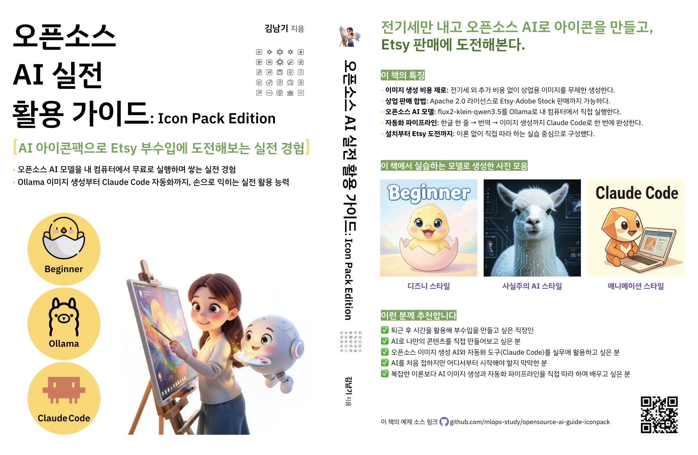

# 오픈소스 AI 실전 활용 가이드: Icon Pack Edition



이 저장소는 **『오픈소스 AI 실전 활용 가이드: Icon Pack Edition』** 도서의 실습 파일과 보조 자료를 제공합니다.

책을 읽으면서 각 장의 명령어를 복사해 바로 실행할 수 있도록 구성되어 있습니다.

---

## 저장소 구조

```
.
├── practice-files/          # 챕터별 실습 파일
│   ├── Chapter_01/          # Ollama 환경 구축과 첫 이미지 생성
│   ├── Chapter_02/          # 이미지 파라미터 완전 정복
│   ├── Chapter_03/          # 프롬프트 작성과 한글→이미지 파이프라인
│   ├── Chapter_04/          # Claude 채팅으로 프롬프트 만들기
│   ├── Chapter_05/          # Claude Code로 이미지 생성 자동화
│   ├── Chapter_06/          # 팔리는 이미지 만들기 — 상업용 품질 기준
│   └── Chapter_07/          # AI 이미지로 수익 만들기 — 판매 플랫폼 완전 정복
├── appendix/                # 부록 PDF (환경 설정 가이드)
│   ├── 부록 A. 터미널 시작하기.pdf
│   ├── 부록 B. 텍스트 에디터로 파일 만들기.pdf
│   ├── 부록 C. Claude.ai 채팅 사용하기.pdf
│   ├── 부록 D. Claude Code 설치하기.pdf
│   ├── 부록 E. Claude Code 기본 사용법.pdf
│   ├── 부록 F. Python 설치하기 (pyenv).pdf
│   └── 부록 G. Ollama 이미지 생성 오류 해결하기.pdf
├── MyIconShop/               # 아이콘팩 실전 샘플 (minimal / pink 3d 2세트)
│   ├── prompts/              # images/의 이미지를 생성한 프롬프트 모음
│   ├── images/                # 프롬프트를 기반으로 flux2-klein으로 생성한 이미지 모음
│   └── etsy_listing/          # Etsy 판매용 이미지·설명 정리 폴더
└── remove_background.py     # 배경 투명화 스크립트
```

---

## 챕터별 내용

| 챕터 | 제목 | 주요 내용 |
|------|------|-----------|
| 1장 | Ollama 환경 구축과 첫 이미지 생성 | Ollama 설치, flux2-klein 및 qwen3.5 모델 다운로드, 첫 이미지 생성 |
| 2장 | 이미지 파라미터 완전 정복 | `--width`, `--height`, `--steps`, `--seed`, `--negative` 플래그 사용법 |
| 3장 | 프롬프트 작성과 한글→이미지 파이프라인 | 한글 번역 자동화, 프롬프트 라이브러리 구축, 배치 생성 스크립트 |
| 4장 | Claude 채팅으로 프롬프트 만들기 | Claude.ai로 프롬프트 생성·다듬기, 스타일 시리즈 기획 |
| 5장 | Claude Code로 이미지 생성 자동화 | MCP 설정, `/generate-image` 스킬 제작, 대량 자동 생성 |
| 6장 | 팔리는 이미지 만들기 | 상업용 라이선스 확인, FLUX 버전별 허용 범위 |
| 7장 | AI 이미지로 수익 만들기 | Etsy 아이콘팩 등록, ZIP 패키징, 월간 생산 루틴 자동화 |

---

## 실습 파일 사용법

각 챕터 폴더의 `practice.md`를 열고, 책의 같은 절 번호를 찾아 명령어를 복사해 터미널에 붙여넣습니다.

```bash
# 실습 폴더 생성 (1회)
mkdir -p ~/book-practice/Chapter0{1,2,3,4,5,6,7}
```

---

## 아이콘팩 샘플 (`MyIconShop/`)

7장(Etsy 아이콘팩 등록)에서 실제로 판매용으로 만든 두 아이콘팩 세트 — **미니멀 앱 아이콘**과
**핑크 3D 앱 아이콘** — 을 만드는 과정을 그대로 공개한 샘플입니다.

```
MyIconShop/
├── prompts/                 # images/의 이미지를 생성한 프롬프트 모음
│   ├── minimal_app_icons/
│   └── pink_3d_app_icons/
├── images/                  # 프롬프트를 기반으로 flux2-klein으로 생성한 이미지 모음
│   ├── minimal_app_icons/
│   └── pink_3d_app_icons/
└── etsy_listing/            # Etsy 판매에 필요한 이미지·설명을 정리한 폴더
    ├── minimal_app_icons/
    └── pink_3d_app_icons/
```

| 폴더 | 내용 |
|------|------|
| `prompts/` | 아이콘별 프롬프트 원문(`.md`)과 작업 진행 기록(`PROGRESS.md`) |
| `images/` | 프롬프트로 생성한 원본 아이콘 이미지 (세트당 15종) |
| `etsy_listing/` | 배경 제거된 판매용 아이콘(`icons/`), 리스팅 썸네일(`thumbnail/`), 상품 설명(`README.txt`) |

각 세트의 `prompts/` 폴더를 참고하면 어떤 프롬프트로 어떤 이미지가 나왔는지 1:1로 대응해 볼 수 있고,
`etsy_listing/` 폴더는 실제 Etsy 상품 등록 시 올린 파일 구성을 그대로 보여줍니다.

---

## 배경 투명화 스크립트 (`remove_background.py`)

생성된 이미지의 배경을 제거해 투명 PNG로 변환합니다. 경계 안티에일리어싱과 흰 테두리(halo)
제거까지 신경 쓴 v2 스크립트로, 4가지 방식을 지원합니다.

| 방식 | 명령어 옵션 | 적합한 용도 |
|------|------------|------------|
| 솔리드 (기본값) | _(옵션 없음)_ / `--solid` | 아이콘팩 등 매끄러운 경계 + 얼룩·흰 테두리 없이 처리 (rembg 다수결 합의 + 슈퍼샘플링) |
| 소프트 | `--soft` | rembg 설치 없이 색상 기반으로 안티에일리어싱 경계 처리 |
| AI (rembg) | `--ai` | 복잡한 배경, 사진, 인물·동물 |
| 하드 | `--hard` | 기존 이진 플러드필 방식 (비교·디버깅용) |

**주요 옵션**

| 옵션 | 설명 |
|------|------|
| `--color R,G,B` | 배경색 직접 지정 (기본: 가장자리 테두리 중앙값 자동 감지). `--soft`/`--hard`에서만 사용 |
| `--tolerance N` | 배경 판정 색상 허용 오차 (기본: 15). `--soft`/`--hard`에서만 사용 |
| `--band N` | 경계 소프트 처리 대역 폭(픽셀, 기본: 2). `--solid`/`--soft`에서 사용 |
| `--min-size N` | 이 크기 미만의 고립된 조각은 노이즈로 제거 (기본: 32, 0이면 끔) |
| `--model 이름` | rembg 주 모델 (기본: `isnet-general-use`). `--solid`/`--ai`에서 사용 |
| `--supersample N` | 처리 배율 (기본: 2). 확대→처리→축소로 경계 품질 향상. `--solid`에서만 사용 |
| `--enhance N` | 실루엣 추출용 대비 증폭 배율 (기본: 3.0). `--solid`에서만 사용 |
| `--output 경로` | 출력 파일 경로 (입력 1개일 때만) |
| `--output-dir 경로` | 출력 디렉토리 — 여러 입력을 일괄 처리할 때 사용 (모델은 한 번만 로드됨) |

**실행 예시**

```bash
# 기본 (솔리드 방식) — 매끄러운 경계 + 얼룩·흰 테두리 없음
python remove_background.py icon.png --output icon_nobg.png

# 소프트 방식 — rembg 설치 없이 색상 기반으로 처리
python remove_background.py logo.png --soft

# AI 방식 (복잡한 배경·사진)
python remove_background.py photo.jpg --ai

# 배경색과 허용 오차 직접 지정 (소프트 방식)
python remove_background.py banner.png --soft --color "240,240,240" --tolerance 30

# 여러 파일 일괄 처리 (모델 한 번만 로드)
python remove_background.py images/*.png --output-dir ./output
```

> Python 3.11 이상 필요. 첫 실행 시 필요한 패키지(Pillow, numpy, scipy, 방식에 따라 rembg)를 자동 설치합니다.

---

## 부록 (appendix/)

환경 설정이 처음이라면 아래 부록 PDF를 순서대로 읽으세요.

| 파일   | 내용 |
|------|------|
| 부록 A | 터미널 시작하기 |
| 부록 B | 텍스트 에디터로 파일 만들기 |
| 부록 C | Claude.ai 채팅 사용하기 |
| 부록 D | Claude Code 설치하기 |
| 부록 E | Claude Code 기본 사용법 |
| 부록 F | Python 설치하기 (pyenv) |
| 부록 G | Ollama 이미지 생성 오류 해결하기 |

---

## 사용 모델

| 모델 | 용도 | 라이선스 |
|------|------|---------|
| `x/flux2-klein:4b` | 이미지 생성 (상업용) | Apache 2.0 |
| `x/flux2-klein:9b` | 이미지 생성 (고품질, 연습용) | 비상업용 |
| `qwen3.5:4b` | 한글 → 영어 프롬프트 번역 | - |

---

## 저자

- **김남기** — 카카오뱅크 AI 엔지니어, 『MLOps 구축 가이드북』 저자. 
- 📧 mlops.study@gmail.com
